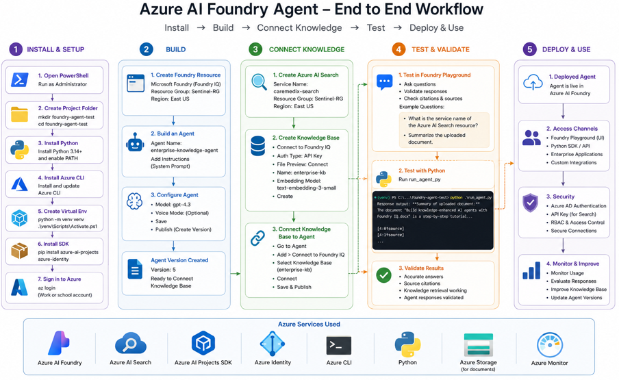
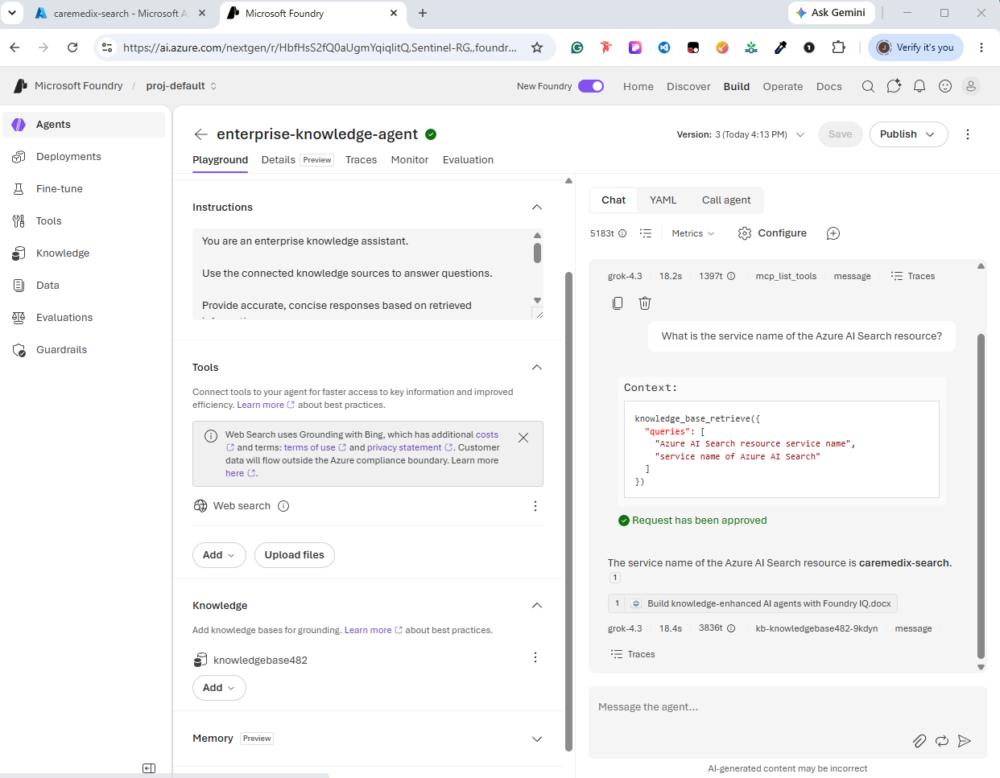
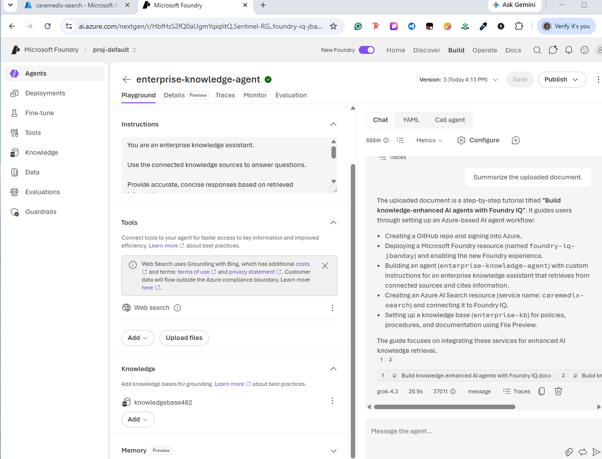
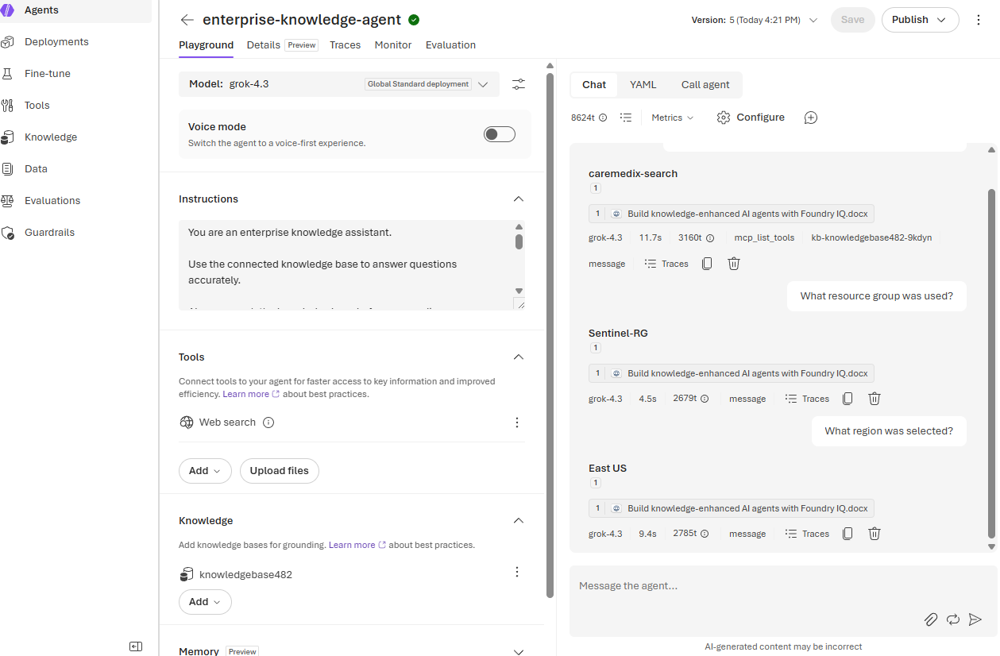
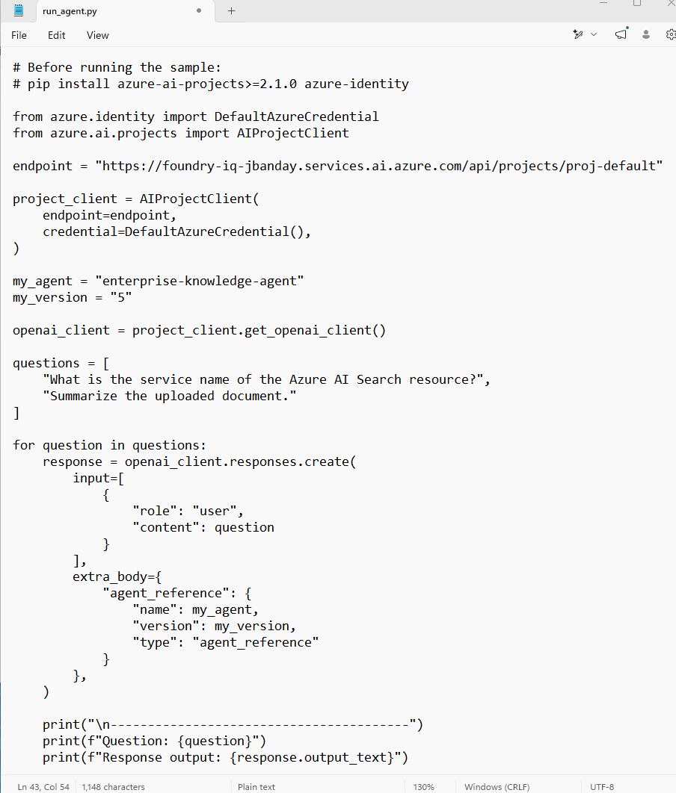
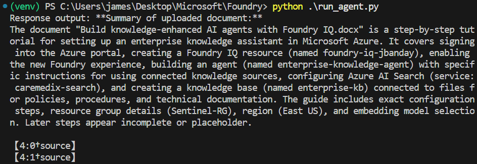

# Architecture Overview

## Project Name

Build Knowledge-Enhanced AI Agents with Foundry IQ

---

## Purpose

This project demonstrates how Microsoft Foundry IQ, Azure AI Search, Azure AI Projects SDK, Azure Identity, and Python can be integrated to create an enterprise knowledge-enhanced AI agent capable of retrieving information from connected knowledge sources and generating grounded responses.

The solution enables users to:

* Search enterprise knowledge sources
* Retrieve relevant information
* Answer questions accurately
* Summarize uploaded documents
* Provide grounded responses
* Reduce unsupported AI-generated content

---

## Architecture Diagram

### Figure 1: Azure AI Foundry End-to-End Workflow

Description:

Illustrates the complete Microsoft Foundry IQ workflow from installation and setup through agent deployment, knowledge integration, testing, validation, and production usage.

References:

AWS Pricing Calculator User Guide: This guide provides detailed instructions on using the AWS Pricing Calculator to estimate costs for different AWS services.



---

## High-Level Architecture

```text
+---------------------+
|       User          |
+----------+----------+
           |
           v
+---------------------+
| Foundry IQ Agent    |
| enterprise-         |
| knowledge-agent     |
+----------+----------+
           |
           v
+---------------------+
| Knowledge Base      |
| knowledgebase42     |
+----------+----------+
           |
           v
+---------------------+
| Azure AI Search     |
| caremedix-search    |
+----------+----------+
           |
           v
+---------------------+
| Enterprise Docs     |
| Policies            |
| Procedures          |
| Technical Guides    |
+----------+----------+
           |
           v
+---------------------+
| Grounded Response   |
+---------------------+
```

---

## Solution Components

### Microsoft Foundry IQ

Provides the platform for creating, configuring, testing, and deploying AI agents.

Responsibilities:

* Agent hosting
* Knowledge integration
* Agent lifecycle management
* Playground testing
* Version management

---

### Enterprise Knowledge Agent

Agent Name:

```text
enterprise-knowledge-agent
```

Purpose:

Provides grounded responses using connected enterprise knowledge sources.

Responsibilities:

* Question answering
* Document summarization
* Knowledge retrieval
* Citation generation
* Response validation

---

### Azure AI Search

Service Name:

```text
caremedix-search
```

Purpose:

Indexes and retrieves enterprise knowledge documents.

Responsibilities:

* Semantic search
* Vector search
* Content retrieval
* Document indexing
* Search relevance ranking

---

### Knowledge Base

Knowledge Base Name:

```text
knowledgebase42
```

Purpose:

Stores enterprise documents connected to the agent.

Examples:

* Policies
* Procedures
* Technical documentation
* Training materials
* Architecture guides

---

### Azure AI Projects SDK

Used by Python to communicate with Foundry IQ.

Primary Components:

```python
AIProjectClient
```

```python
DefaultAzureCredential
```

Capabilities:

* Agent execution
* Project access
* Authentication
* Response retrieval

---

### Azure Identity

Provides secure authentication.

Authentication Method:

```python
DefaultAzureCredential()
```

Benefits:

* Secure authentication
* No embedded credentials
* Azure-native identity support

---

## Deployment Resources

| Resource         | Value                      |
| ---------------- | -------------------------- |
| Foundry Resource | foundry-iq-jbanday         |
| Project Name     | proj-default               |
| Agent Name       | enterprise-knowledge-agent |
| Agent Version    | 5                          |
| Resource Group   | Sentinel-RG                |
| Region           | East US                    |
| Azure AI Search  | caremedix-search           |
| Knowledge Base   | knowledgebase42            |
| Embedding Model  | text-embedding-3-small     |

---

## Data Flow

### Step 1

User submits a question.

Example:

```text
What is the service name of the Azure AI Search resource?
```

---

### Step 2

Foundry IQ receives the request.

---

### Step 3

Agent queries the connected knowledge base.

---

### Step 4

Azure AI Search retrieves relevant content.

---

### Step 5

Retrieved context is returned to the agent.

---

### Step 6

Agent generates a grounded response.

Example:

```text
caremedix-search
```

---

## Authentication Flow

```text
PowerShell
    |
    v
Azure CLI Login
    |
    v
DefaultAzureCredential
    |
    v
Azure AI Projects SDK
    |
    v
Foundry IQ Project
```

---

## Validation Architecture

### Figure 2: Azure AI Search Validation

Description:

Validates successful retrieval of Azure AI Search information from the connected knowledge base.



---

### Figure 3: Resource Validation

Description:

Validates successful retrieval of deployment resource information from the connected knowledge base.



---

### Figure 4: Document Summarization Validation

Description:

Shows successful document summarization using the enterprise knowledge base.



---

### Figure 5: Python SDK Integration

Description:

Illustrates the Python SDK implementation used to communicate with the deployed Foundry IQ agent.



---

### Figure 6: Python Execution Results

Description:

Shows successful execution of the Python validation script and grounded agent responses.



---

## Security Architecture

### Identity Security

Authentication is handled through:

```python
DefaultAzureCredential()
```

Benefits:

* Secure authentication
* Azure-native identity integration
* Reduced credential exposure

---

### Access Control

Recommended Controls:

* Azure RBAC
* Least privilege access
* Resource-level permissions
* Secure project access

---

### Data Protection

Recommendations:

* Use HTTPS connections
* Restrict sensitive documents
* Review uploaded content
* Validate generated responses

---

## Validation Checklist

| Validation Item              | Expected Result  |
| ---------------------------- | ---------------- |
| Foundry Resource Created     | Success          |
| Agent Created                | Success          |
| Knowledge Base Connected     | Success          |
| Azure AI Search Connected    | Success          |
| Resource Group Retrieved     | Sentinel-RG      |
| Region Retrieved             | East US          |
| Search Service Retrieved     | caremedix-search |
| Document Summarization Works | Success          |
| Python Script Executes       | Success          |

---

## Architecture Benefits

### Knowledge Grounding

Responses are generated using retrieved enterprise content.

### Improved Accuracy

Answers are based on documented information rather than assumptions.

### Enterprise Integration

Supports enterprise document repositories and search services.

### Automation

Python SDK enables automated testing and validation.

### Scalability

Supports additional knowledge sources and enterprise integrations.

---

## Architecture Summary

This architecture integrates Microsoft Foundry IQ, Azure AI Search, Azure AI Projects SDK, Azure Identity, and Python to create a knowledge-enhanced AI assistant capable of retrieving enterprise information and generating grounded responses.

The solution demonstrates a complete workflow from deployment through validation and provides a foundation for future enterprise AI implementations.
